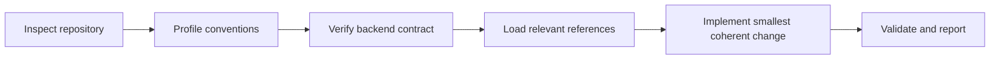

<div align="center">
  <h1>🧠 React Server State Skill Registry</h1>
  <p><strong>Project-aware guidance for reliable, type-safe React server state.</strong></p>
  <p>Inspect the repository. Verify the backend contract. Preserve cache identity. Compose with the architecture already in use.</p>

  <p>
    <a href="https://agentskills.io"></a>
    
    
    
    <a href="https://github.com/barehera/server-state-registry/releases"></a>
  </p>

  <p>
    <a href="#-quick-start">Quick start</a> ·
    <a href="#-operating-model">Operating model</a> ·
    <a href="#-architecture-contract">Architecture</a> ·
    <a href="#-ai-host-support">AI hosts</a> ·
    <a href="#-prompt-cookbook">Prompts</a> ·
    <a href="#-registry-lifecycle">Lifecycle</a>
  </p>
</div>

---

`manage-react-server-state` is a portable Agent Skill for creating, extending, refactoring, and auditing React server-state code. It is optimized for TanStack Query and TypeScript, but it adapts to the consuming repository instead of imposing a fixed application template.

The repository and backend remain the sources of truth. Existing folder structure, transport, generated types, authentication, error handling, response envelopes, pagination, naming, and public imports are inspected before implementation begins.

> [!IMPORTANT]
> This registry distributes engineering guidance, reference documentation, and a non-runtime Posts example. It does not install runtime dependencies, write application code into `src`, or invent missing backend behavior.

## ✨ Engineering outcomes

| Concern | Expected behavior |
| --- | --- |
| **Project fit** | Preserve coherent repository conventions and introduce defaults only when no convention exists. |
| **Contract fidelity** | Derive routes, parameters, payloads, errors, authentication, and pagination from verified backend facts. |
| **Cache correctness** | Model every request variable in the query key and apply explicit mutation cache effects. |
| **Type safety** | Reuse generated or backend-owned types and preserve inference through options, hooks, selectors, and mutations. |
| **Runtime safety** | Validate untrusted serialized data when the project has a runtime-validation boundary. |
| **Composition** | Keep option factories reusable while exposing thin hooks for feature policy and component ergonomics. |
| **Change isolation** | Implement the smallest coherent change without migrating unrelated server-state code. |
| **Maintainability** | Use one vocabulary for operations, cache actions, inputs, keys, options, and hooks. |

## ⚡ Quick start

### Inspect the registry item

```bash
npx shadcn@latest view barehera/server-state-registry/manage-react-server-state
```

### Install the skill

Run from the root of a shadcn-configured project:

```bash
npx shadcn@latest add barehera/server-state-registry/manage-react-server-state
```

### Verify discovery

Confirm the canonical entry point exists:

```text
.agents/skills/manage-react-server-state/SKILL.md
```

Then ask the active coding agent:

```text
What project skills are available?
```

If the host does not discover `.agents/skills`, use the portable invocation:

```text
Read .agents/skills/manage-react-server-state/SKILL.md completely and follow it
for this task. Load only the references it routes you to, inspect the repository
before proposing a structure, and do not invent missing backend contracts.
```

### Installed files

```text
.agents/skills/manage-react-server-state/
├── SKILL.md
├── agents/
│   └── openai.yaml
├── references/
│   ├── architecture.md
│   ├── backend-contracts.md
│   ├── examples.md
│   ├── mutations-cache.md
│   ├── naming.md
│   ├── queries.md
│   └── workflows.md
└── examples/
    └── feature-colocated/

.cursor/rules/
└── manage-react-server-state.mdc
```

The example remains inside the skill directory. It is reference material for the agent and is not copied into application source.

## 🧭 Operating model



The skill follows the same workflow for every repository:

1. Read repository instructions, package manifests, aliases, neighboring features, API clients, QueryClient setup, authentication, schemas, and generated types.
2. Classify the task as `create from scratch`, `create feature`, `add endpoint`, `refactor`, or `audit`.
3. Build a project profile covering placement, naming, transport, contract source, validation, authentication, pagination, and cache conventions.
4. Derive the endpoint contract from code, generated clients, backend documentation, examples, or explicit user input.
5. Ask only for missing facts that cannot be inspected and would materially change correctness.
6. Load only the reference documents needed for the task.
7. Implement the smallest coherent change and preserve unrelated behavior.
8. Run the repository's existing validation commands in proportion to risk.
9. Report changed files, commands, decisions, backend assumptions, and unresolved contract gaps.

### Supported workflows

| Workflow | Typical request | Expected result |
| --- | --- | --- |
| **Create from scratch** | Establish server state in a project without an existing pattern. | A stated architecture decision based on repository constraints and documented defaults. |
| **Create feature** | Add Products, Orders, Users, or another resource. | A complete vertical slice using verified contracts and the project's placement strategy. |
| **Add endpoint** | Add detail, child context, infinite list, or protected read. | A scoped extension of existing keys, options, hooks, and cache behavior. |
| **Refactor** | Standardize inconsistent server-state code. | A migration plan that preserves behavior and public imports unless removal is requested. |
| **Audit** | Review correctness without editing files. | Risk-ordered findings with file references and concrete remediation guidance. |

## 📦 Backend contract input

Concrete backend facts produce the safest implementation. Provide the information that exists; unresolved correctness-critical gaps become focused questions.

```text
Feature/resource:
Existing project files to follow:
Transport or generated client:
Authentication requirement:

Endpoints:
- METHOD /route
- Path parameters:
- Query parameters:
- Request body example:
- Success response example:
- Error response example:

Pagination:
- Request page parameter:
- Response next-page field:
- End-of-list value:

Mutation cache effects:
- Detail to set, patch, invalidate, or remove:
- Lists or related queries to invalidate:

Constraints:
- Files or public APIs that must not change:
- Runtime validation strategy:
- Anything the agent must not refactor:
```

### Contract rules

- Preserve the backend response shape in the query cache unless a deliberate domain transformation is required.
- Reuse generated request, response, error, and pagination types when they are authoritative.
- Do not create frontend/backend mapping layers when both sides represent the same model.
- Treat runtime schemas and TypeScript types as different tools: schemas validate serialized data; types describe compile-time contracts.
- Accept additive backend fields unless the product explicitly requires strict rejection.
- Normalize filters only when multiple caller representations must resolve to one stable cache identity.
- Thread `AbortSignal` through transports that support request cancellation.

## 🏗️ Architecture contract

The skill standardizes responsibilities, dependency direction, and naming. It does not standardize a universal folder tree.

### Semantic responsibilities

| Responsibility | Owns | Must not own |
| --- | --- | --- |
| **Types** | Public operation inputs, backend/generated types, hook option types | Runtime parsing behavior |
| **Schemas** | Runtime validation of untrusted serialized boundaries | Duplicate domain models without a validation need |
| **API operations** | Routes, parameters, transport calls, cancellation, response parsing | React hooks or component state |
| **Query keys** | Complete, stable cache identity and nested context hierarchy | Network requests |
| **Query options** | `queryKey`, `queryFn`, pagination behavior, reusable base options | Component-only orchestration |
| **Query hooks** | React integration, feature policy, auth-aware composition, caller overrides | Repeated query-function definitions |
| **Mutations** | Mutation execution and explicit success/error lifecycle | Hidden global cache behavior |
| **Cache helpers** | Typed set, patch, invalidate, and remove operations | Backend deletion requests |
| **Constants** | Shared defaults and canonical names | Unrelated helper logic |
| **Utilities** | Pure normalization, parsing, matching, and option-composition helpers | Feature policy that belongs in hooks |

### Dependency direction

```text
components
    ↓
query and mutation hooks
    ↓
option factories and cache helpers
    ↓
query keys and API operations
    ↓
transport, backend contracts, shared server-state primitives
```

Dependencies point toward transport and contract primitives. API modules do not import React. Query keys do not depend on hooks. Shared infrastructure does not import feature implementations.

### Supported placement strategies

- Feature-colocated server state.
- Layer-oriented `api`, `queries`, and `mutations` directories.
- Domain-oriented modules.
- Compact single-file features for small resources.
- Generated-client-first projects.
- Existing project-specific structures with coherent ownership.

> [!TIP]
> The bundled Posts implementation demonstrates one feature-colocated design. Copy its reasoning and type relationships—not its routes, backend models, auth imports, folder boundaries, or defaults.

## 🧱 Correctness invariants

| Invariant | Requirement |
| --- | --- |
| **Complete query identity** | Every variable that changes the response belongs in the query key. |
| **Stable inputs** | Public operations receive object inputs so new parameters can be added without positional API churn. |
| **Single query definition** | Option factories own `queryKey` and `queryFn`; hooks compose those options instead of recreating them. |
| **Caller composition** | Hooks preserve caller-provided `select`, `enabled`, and supported TanStack Query overrides with correct inference. |
| **Authentication gating** | Protected queries do not execute or become manually refetchable while authentication requirements are unmet. |
| **Pagination fidelity** | `getNextPageParam` derives from the backend's actual continuation contract and end-of-list value. |
| **Explicit mutation effects** | Each mutation states which detail, list, and context queries are set, patched, invalidated, or removed. |
| **No magic defaults** | Reused limits, stale times, and filter defaults live in named constants. |
| **Transport cancellation** | Query cancellation reaches the underlying request when supported. |
| **No accidental reshaping** | Cached server data remains the server shape unless a documented transformation is required. |

## 🏷️ Canonical vocabulary

Use the project's existing vocabulary when it is coherent. When no convention exists, use the following defaults consistently across types, functions, files, keys, options, hooks, and cache helpers.

### Operations

| Intent | Canonical name |
| --- | --- |
| Finite collection | `list` |
| Infinite or cursor collection | `infiniteList` |
| Single resource | `detail` |
| Create mutation | `create` |
| Update mutation | `update` |
| Delete mutation | `delete` |
| Nested detail context | Resource-specific noun such as `comments`, `related`, or `likes` |

### Cache actions

| Intent | Canonical verb | Example |
| --- | --- | --- |
| Write complete data | `set` | `setDetail` |
| Merge partial data | `patch` | `patchDetail` |
| Mark stale and refetch when active | `invalidate` | `invalidateLists` |
| Remove cached data | `remove` | `removeDetail` |

Reserve `delete` for the backend mutation. Use `remove` for local cache removal.

### Public API shapes

```ts
type PostDetailQueryInput = {
  postId: string;
};

type PostsListQueryInput = {
  filters?: PostsListFilters;
  queryOptions?: PostsListQueryOverrides;
};
```

Object inputs keep public APIs extensible and make call sites self-documenting, even when an operation initially needs one field.

## 📚 Reference library

| Reference | Use when |
| --- | --- |
| [architecture.md](skills/manage-react-server-state/references/architecture.md) | Choosing placement, file boundaries, dependency direction, or shared ownership. |
| [backend-contracts.md](skills/manage-react-server-state/references/backend-contracts.md) | Modeling responses, runtime validation, errors, filters, or pagination. |
| [naming.md](skills/manage-react-server-state/references/naming.md) | Establishing vocabulary or migrating inconsistent names. |
| [queries.md](skills/manage-react-server-state/references/queries.md) | Designing keys, option factories, hooks, overrides, selectors, or authentication. |
| [mutations-cache.md](skills/manage-react-server-state/references/mutations-cache.md) | Defining mutation ownership, cache effects, or optimistic updates. |
| [workflows.md](skills/manage-react-server-state/references/workflows.md) | Running create, endpoint, refactor, or audit procedures. |
| [examples.md](skills/manage-react-server-state/references/examples.md) | Adapting the complete Posts example to a different project structure. |

The complete non-runtime implementation is available under [examples/feature-colocated](skills/manage-react-server-state/examples/feature-colocated).

## 🤖 AI host support

An AI model and an AI coding host are separate layers. GPT, Claude, Gemini, DeepSeek, Qwen, Mistral, Grok, and Llama-family models can follow the skill when the host provides repository access. Discovery paths and invocation commands are host capabilities.

| Agent host | Registry installation | Activation |
| --- | --- | --- |
| **OpenAI Codex** — desktop, CLI, IDE | Native `.agents/skills` discovery | Mention `$manage-react-server-state`, run `/skills`, or describe a matching task. |
| **Google Gemini CLI** | Native `.agents/skills` alias | Run `/skills list`; use `/skills reload` after installing during a session. |
| **Google Antigravity** — IDE and CLI | Native `.agents/skills` discovery | Ask for available skills; Antigravity CLI also supports `/skills`. |
| **GitHub Copilot** — VS Code, JetBrains, GitHub, CLI, app | Native `.agents/skills` discovery | Automatic matching; Copilot CLI supports `/manage-react-server-state`. |
| **Cursor** — editor and CLI | Installed `.cursor/rules` adapter points to the canonical skill | Use the slash menu, name the skill, or use the portable invocation. |
| **Claude Code** | Canonical file is readable; native skills use `.claude/skills` | Use the portable invocation or install a Claude-native copy instead. |
| **Other repository-aware agents** | Host-dependent | Point the agent directly to the canonical `SKILL.md`. |

<details>
<summary><strong>OpenAI Codex</strong></summary>

```text
Use $manage-react-server-state to inspect this repository and create the Products
server state from the backend contract below.
```

Codex can activate the skill implicitly from its description or explicitly through `$manage-react-server-state`. Use `/skills` in the CLI or IDE to inspect discovery. See the [Codex skills documentation](https://developers.openai.com/codex/skills).

</details>

<details>
<summary><strong>Google Gemini CLI and Antigravity</strong></summary>

Gemini CLI and Antigravity understand the canonical `.agents/skills` installation.

```text
Use manage-react-server-state to audit the existing Products server state. Report
contract and cache-identity problems before changing files.
```

See the [Gemini CLI Agent Skills guide](https://geminicli.com/docs/cli/using-agent-skills/) and [Antigravity Skills codelab](https://codelabs.developers.google.com/getting-started-with-antigravity-skills?hl=en).

</details>

<details>
<summary><strong>Anthropic Claude Code</strong></summary>

Claude Code's native project location is `.claude/skills`. The cross-agent installation remains usable through an explicit file reference:

```text
Read .agents/skills/manage-react-server-state/SKILL.md completely and use it to
add the Orders server state. Follow its reference routing and inspect the current
project before editing anything.
```

For a Claude-only repository, install a native copy instead of the shadcn installation:

```bash
gh skill install barehera/server-state-registry manage-react-server-state --agent claude-code
```

Avoid duplicate canonical and host-native copies unless independent update ownership is intentional. See the [Claude Code skills guide](https://code.claude.com/docs/en/slash-commands).

</details>

<details>
<summary><strong>GitHub Copilot and Cursor</strong></summary>

Copilot recognizes `.agents/skills` directly. Cursor receives a thin rule adapter that routes matching work to the canonical skill.

```text
Use manage-react-server-state. Audit the existing Bookmarks queries and mutations.
Report naming, cache identity, contract, cancellation, and authentication problems
before changing files.
```

See GitHub's [Agent Skills overview](https://docs.github.com/en/copilot/concepts/agents/about-agent-skills) and Cursor's [Agent Skills release notes](https://cursor.com/changelog/2-4).

</details>

<details>
<summary><strong>DeepSeek and other model providers</strong></summary>

Select the model inside a repository-aware coding host, then use the host's Agent Skill discovery or the portable invocation. No provider-specific copy is required because the skill is Markdown guidance with repository-relative references.

</details>

## 📝 Prompt cookbook

Replace `$manage-react-server-state` with the active host's invocation syntax when necessary.

<details open>
<summary><strong>Create a feature from backend contracts</strong></summary>

```text
Use $manage-react-server-state.

Inspect this repository first, then create server state for Products using its
existing architecture, transport, auth, and validation strategy.

GET /api/products?search=&limit=
Response: { "data": Product[] }

GET /api/products/:productId
Response: { "data": Product }

Product: { id: string, name: string, price: number, updatedAt: string }

Ask only for missing backend facts that materially affect correctness. Do not
invent an error envelope or pagination contract.
```

</details>

<details>
<summary><strong>Add a cursor-paginated infinite query</strong></summary>

```text
Use $manage-react-server-state to add an infinite Orders list.

Request: GET /api/orders?cursor=<string>&limit=<number>
Response: { "data": Order[], "meta": { "nextCursor": string | null } }

`null` means there is no next page. Preserve the complete backend page response
in the cache and derive getNextPageParam from meta.nextCursor. Centralize reused
defaults; do not duplicate magic limits in hooks or API functions.
```

</details>

<details>
<summary><strong>Add a nested context endpoint</strong></summary>

```text
Use $manage-react-server-state to add:
GET /api/posts/:postId/comments?limit=<number>
Response: { "data": Comment[] }

Inspect the existing Posts key hierarchy, options, hooks, and cache helpers.
Model comments under the Post detail identity when that matches the current key
design. Preserve public imports and avoid unrelated refactors.
```

</details>

<details>
<summary><strong>Add a protected query</strong></summary>

```text
Use $manage-react-server-state to add the protected Related Products query.
Reuse the project's auth/session integration. The request must not execute or be
manually refetchable while logged out. Keep auth policy reusable and separate
from the resource's base query options. Preserve caller select and enabled logic.
```

</details>

<details>
<summary><strong>Use generated backend types</strong></summary>

```text
Use $manage-react-server-state to create Bookmarks queries from the generated
OpenAPI client. Reuse generated request, response, pagination, and error types.
Do not create duplicate schemas or frontend/backend mapping models unless a real
runtime validation boundary or domain transformation requires them.
```

</details>

<details>
<summary><strong>Refactor inconsistent server state</strong></summary>

```text
Use $manage-react-server-state to refactor the Memories server state.

Inspect every query key, option factory, hook, API call, mutation, and cache
operation. Report a behavior-preserving migration plan before editing. Establish
one vocabulary across operations and cache actions, preserve public imports, and
avoid unrelated architecture changes.
```

</details>

<details>
<summary><strong>Audit without modifying files</strong></summary>

```text
Use $manage-react-server-state to audit this repository's server-state layer.
Do not modify files. Report risk-ordered findings with file and line references.
Check backend fidelity, query identity, normalized inputs, abort signals, auth
gating, pagination, mutation effects, magic defaults, and hook option inference.
```

</details>

## 🔄 Registry lifecycle

### Inspect

```bash
npx shadcn@latest view barehera/server-state-registry/manage-react-server-state
```

### Install

```bash
npx shadcn@latest add barehera/server-state-registry/manage-react-server-state
```

### Update

```bash
npx shadcn@latest add barehera/server-state-registry/manage-react-server-state --overwrite
```

Review the diff before committing an update. Installed project copies do not update automatically.

### Publishing behavior

- The public GitHub repository is the source registry. The shadcn CLI reads the root `registry.json` and declared files directly from GitHub.
- Every push to `main`, including a merged pull request, runs the release workflow.
- The workflow installs dependencies, validates the registry, builds the resolved item, analyzes Conventional Commits, and publishes a GitHub Release when a qualifying change exists.
- The built `manage-react-server-state.json` is attached to the matching GitHub Release.
- Consumer projects choose when to update by rerunning the install command with `--overwrite`.

## 🛠️ Registry development

### Requirements

- Node.js `^22.14.0` or `>=24.10.0` for semantic-release 25.
- npm for the committed lockfile and CI-equivalent installation.

### Validate locally

```bash
npm ci
npm run validate
```

Validation checks the registry schema contract, file targets, dependency ranges, skill frontmatter, release configuration, and generated registry output.

### Release semantics

| Conventional Commit | Release |
| --- | --- |
| `fix: correct authenticated query gating` | Patch |
| `docs: improve backend contract guidance` | Patch |
| `refactor: simplify query-key workflow` | Patch |
| `feat: add generated-client workflow` | Minor |
| `feat!: change canonical operation names` | Major |

A `BREAKING CHANGE:` footer also creates a major release. `chore`, `ci`, `test`, and `build` commits do not publish a release by default.

Git tags retain the skill namespace:

```text
manage-react-server-state-v1.0.0
manage-react-server-state-v1.1.0
manage-react-server-state-v2.0.0
```

GitHub Release titles use the concise version form, such as `v1.1.0`. The root package version remains `0.0.0-development`; Git tags and GitHub Releases are the distribution version source of truth.

## 🔐 Trust and scope

- Review `SKILL.md`, references, and adapters before committing an installed update.
- Keep backend secrets, credentials, private schemas, and environment values out of prompts and committed skill files.
- Treat the bundled implementation as documentation, not application source.
- Preserve repository permission and approval boundaries when an agent runs validation commands.
- Do not add a transport, schema library, auth provider, response envelope, or folder convention solely because the reference example uses one.

## 🩺 Troubleshooting

| Problem | Resolution |
| --- | --- |
| Skill is not listed | Confirm `.agents/skills/manage-react-server-state/SKILL.md`, reload or restart the host, then use the portable invocation. |
| Agent proposes the Posts folder tree | Require repository inspection and state that the example is a responsibility reference, not a template. |
| Agent guesses response fields or pagination | Provide the contract template and require unresolved fields to become questions. |
| Query hooks lose `select` inference | Ask for typed query-option overrides and preservation of selected `TData` through the hook boundary. |
| Protected queries can refetch while logged out | Require reusable authenticated-query composition that gates both automatic execution and manual refetch behavior. |
| Cache changes after a mutation are unclear | Specify affected detail, list, and nested context identities before implementation. |
| Installed guidance is stale | Rerun the update command with `--overwrite`, review the diff, and commit the updated files. |

## 📎 Project links

- [Registry definition](registry.json)
- [Canonical skill](skills/manage-react-server-state/SKILL.md)
- [Complete reference implementation](skills/manage-react-server-state/examples/feature-colocated)
- [GitHub Releases](https://github.com/barehera/server-state-registry/releases)
- [shadcn GitHub Registries documentation](https://ui.shadcn.com/docs/registry/github)
